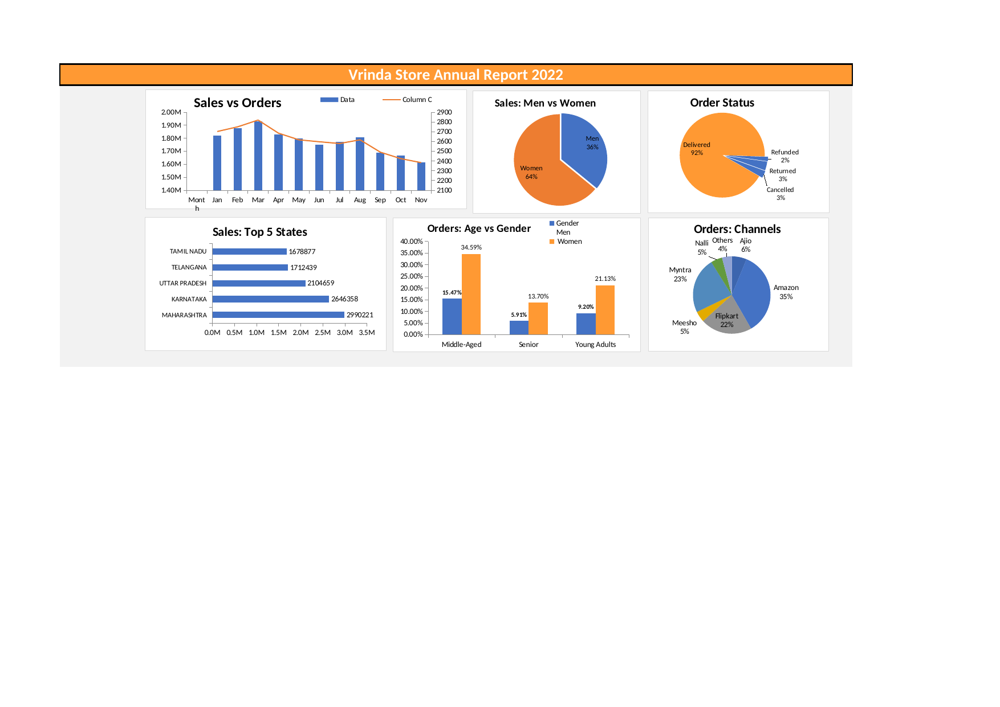

# Vrinda Store — Sales & Order Analysis (Excel Dashboard)

End-to-end analysis of 31,000+ e-commerce orders for an Indian clothing brand ("Vrinda Store"), built entirely in Excel using pivot tables, slicers, and interactive charts to uncover sales trends, customer behavior, and channel performance.



## 📊 Project Overview

The raw dataset contained 31,047 order-level records (Order ID, Customer ID, Gender, Age, Date, Status, Sales Channel, SKU, Category, Amount, Shipping Location). The goal was to clean this data and build a self-service dashboard that answers key business questions without needing to touch the raw sheet.

## 🛠️ Tools Used
- **Microsoft Excel** — Pivot Tables, Pivot Charts, Slicers, data cleaning
- Formulas for KPI calculation (Total Sales, Total Orders, Average Order Value)

## ❓ Business Questions Answered
- What does the month-on-month sales and order trend look like?
- How do sales split between men and women customers?
- What's the breakdown of order status (Delivered / Cancelled / Returned / Refunded)?
- Which states generate the most revenue?
- How does purchasing behavior differ across age groups and gender?
- Which sales channel (Amazon, Flipkart, Myntra, Ajio, etc.) drives the most orders?

## 🔑 Key Insights
- **Total revenue:** ₹2.12 Cr across 31,047 orders — average order value of **₹682**
- **Women customers drove ~64% of total revenue** vs. 36% from men
- **Amazon is the top channel** (35% of orders), followed by Myntra (23%) and Flipkart (22%)
- **Maharashtra, Karnataka, and Uttar Pradesh** are the top 3 states by sales
- Sales peaked in **March** and gradually declined toward the year-end
- ~92% of orders were successfully **Delivered**; ~5% Returned/Refunded combined

## 📁 Repository Structure
```
├── Vrinda_Store_Data_Analysis.xlsx   # Full workbook: raw data + pivot tables + dashboard
├── images/
│   └── dashboard_preview.png         # Dashboard screenshot
└── README.md
```

## 🚀 How to Use
1. Download `Vrinda_Store_Data_Analysis.xlsx`
2. Open in Excel and go to the **"Vrinda Store Report 2022"** sheet for the dashboard
3. Use the slicers (Month, Channel, Category — visible on the left) to filter the dashboard and watch all charts update live

## 📌 Note
This project focuses on Excel-based analysis (pivot tables, charts, slicers) to demonstrate data cleaning, KPI building, and business storytelling skills without code.
